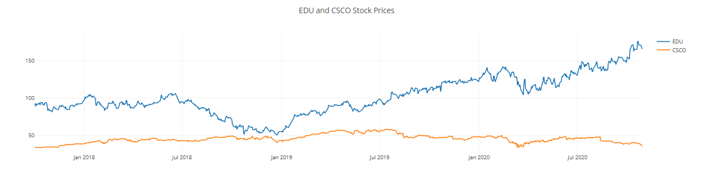
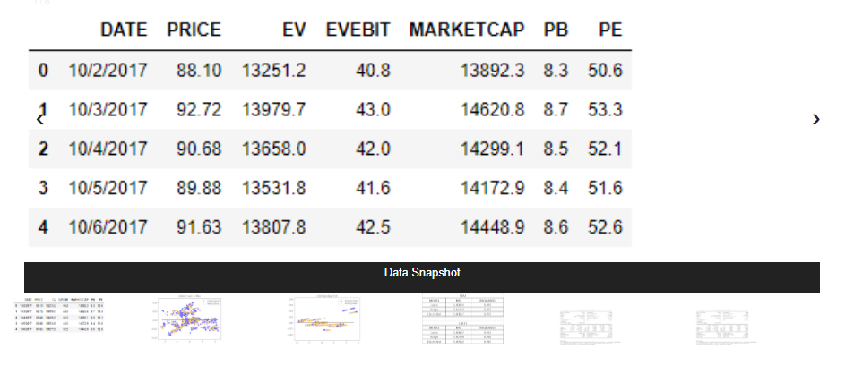
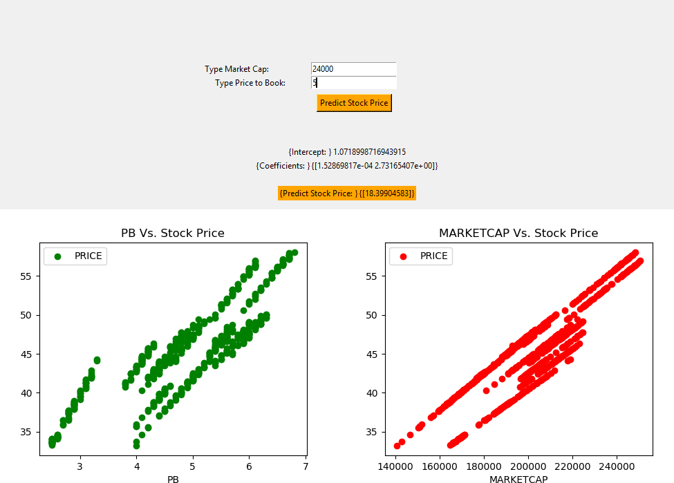

# Stock Predictor

# Machine Learning: Stock Prices

## Introduction

The objective of this project was to apply Machine Learning models to help in prediciting future stock prices.\
We used two stocks in particular, New Oriental Education & Technology Group Inc. (EDU) and Cisco Systems, Inc. (CSCO).\
Using a Long short-term memory (LSTM) and Multivariate regression model, after training and testing, we were able to predict stock prices

## Programs used:
* Javascript
* HTML
* Pandas
* Jupyter Notebook
* Python.
* Tkinter

## Visualizations made:
* Interactive D3 graphs

* HTML slideshow gallery

## Additional Components
Stock Predictor Interface

## Data Sources:
* https://finance.yahoo.com 
* https://www.quandl.com.

## Requirements to run the app on the local machine

* Download entire folder from https://github.com/taureanh/Tkinter-Interface
* Run app.py
* Access at local host http://127.0.0.1:5000/

## Remote Access
* https://stock-predictor1.herokuapp.com/

## Please Note: 
In our deployed website  we had to remove the predict tab functionality due to the module tkinter not able to be deployed by Heroku
It runs locally through our app.py.